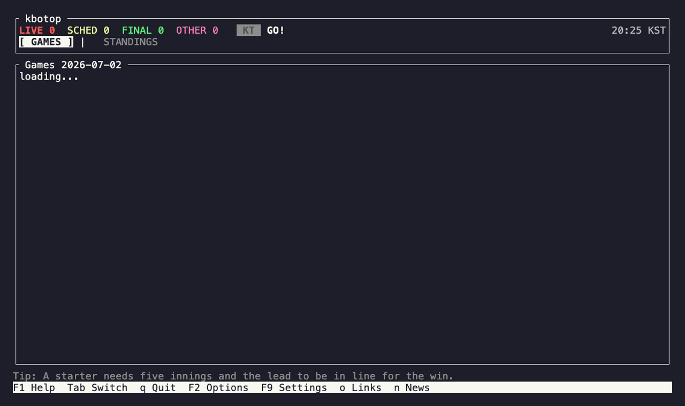

<div align="center">

# kbotop

**KBO baseball in your terminal** — scores, text play-by-play, strike-zone pitch tracking.

[](https://crates.io/crates/kbotop)
[](https://github.com/wantaekchoi/kbotop/releases)
[](https://github.com/wantaekchoi/kbotop/actions/workflows/ci.yml)
[](LICENSE)
[](https://codecov.io/gh/wantaekchoi/kbotop)



[한국어](README.md)

</div>

Leave it open and the score, count, runners, and play-by-play stay current. For a game in progress it draws each pitch in the strike zone, so you get location and speed, not just the line score.

No API key, one static binary.

## Install

```sh
# crates.io
cargo install kbotop

# Homebrew
brew install wantaekchoi/tap/kbotop

# prebuilt binary (macOS arm64/x64, Linux, Windows)
curl --proto '=https' --tlsv1.2 -LsSf https://github.com/wantaekchoi/kbotop/releases/latest/download/kbotop-installer.sh | sh
```

## Usage

```sh
kbotop                    # today's games
kbotop --team lg          # straight into your team's live game
kbotop --date yesterday   # also: YYYY-MM-DD, YYYYMMDD, today, tomorrow, +N, -N
kbotop --lang en          # ko / en / ja (default: auto by locale)
```

Vim-style keys. Press `?` in the app for the full list.

- List: `Enter` live view · `Tab` games/standings · `F2` date · `F9` settings · `o` team links · `n` news
- Live: `←`/`→` pitches · `[`/`]` rewind at-bats (press again at an inning's first at-bat to pull in the inning before it) · `j`/`k` and `gg`/`G` play-by-play cursor

## Configuration

`$XDG_CONFIG_HOME/kbotop/config.toml`, falling back to `~/.config/kbotop/config.toml`. Change your team, language, poll interval, and theme from the `F9` screen. Each change saves right away.

A theme is a preset (`default` / `high-contrast` / `mono`) plus an accent color. `mono` uses no color at all, so it stays readable on monochrome terminals.

## Disclaimer

A fan-made, unofficial tool. Data comes from Naver Sports' public (unofficial) endpoints, and the rights to it belong to the KBO and Naver. For personal, non-commercial use. I act on any rights-holder request promptly.

News comes from each publisher's RSS feed: the headline and a short excerpt only. Follow the link for the full article.

## License

[The Unlicense](LICENSE) — public domain. Dependency license notices are in [THIRD-PARTY.md](THIRD-PARTY.md).
