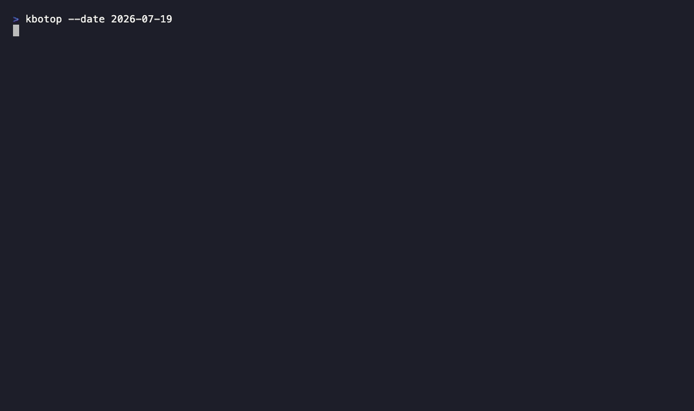

<div align="center">

# kbotop

**터미널에서 보는 KBO 프로야구 라이브 뷰어** — 스코어, 문자중계, 스트라이크존 투구 추적이 화면 안에서 계속 갱신됩니다.

[](https://crates.io/crates/kbotop)
[](https://github.com/wantaekchoi/kbotop/releases)
[](https://ratatui.rs)
[](LICENSE)



[English](README.en.md)

</div>

## 소개

`kbotop`은 KBO 프로야구를 터미널에서 보는 인터랙티브 뷰어입니다. 오늘의 경기를 라이브 대시보드로 보여줍니다. 점수, 볼카운트, 주자, 문자중계가 한 화면에서 알아서 갱신됩니다.

경기가 진행 중이면 네이버 투구 추적 데이터로 공 하나하나를 스트라이크존에 그려 줍니다. 라인스코어만이 아니라 로케이션과 구속까지 보입니다.

API 키가 필요 없습니다. 정적 바이너리 하나로 동작합니다.

## 설치

```sh
# crates.io
cargo install kbotop

# Homebrew
brew install wantaekchoi/tap/kbotop

# 미리 빌드된 바이너리 (macOS arm64/x64, Linux)
curl --proto '=https' --tlsv1.2 -LsSf https://github.com/wantaekchoi/kbotop/releases/latest/download/kbotop-installer.sh | sh
```

## 사용법

```sh
kbotop                    # 오늘 경기
kbotop --team lg          # 내 팀 라이브 경기로 바로 진입
kbotop --date yesterday   # 다른 날짜: YYYY-MM-DD, YYYYMMDD, today, tomorrow, +N, -N
```

Vim 스타일로 움직입니다. 최신 키 목록은 앱 안 `?` 도움말이 기준입니다.

- 이동: `j` / `k` 또는 방향키
- 라이브 뷰 열기: `Enter`
- 경기 / 순위 전환: `Tab`
- 옵션 픽커(날짜·팀·폴링 주기): `F2`
- 구단 공홈·굿즈몰 열기: `o`
- 뉴스 기사 열기: `n`
- 투구 하나씩 보기: `Left` / `Right` (라이브 뷰)
- 도움말: `?`
- 종료: `q`

## 설정

`$XDG_CONFIG_HOME/kbotop/config.toml` (없으면 `~/.config/kbotop/config.toml`). 응원 팀과 폴링 주기를 설정합니다.

## 고지

팬이 만든 비공식 도구입니다. 데이터는 네이버 스포츠의 공개(비공식) 엔드포인트에서 가져오며, 데이터의 모든 권리는 KBO와 네이버에 있습니다. 개인·비상업 용도로만 사용해 주세요. 권리자가 요청하면 즉시 조치합니다.

## 라이선스

[MIT](LICENSE)
