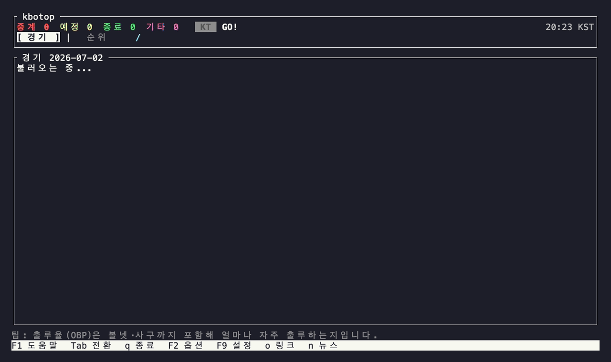

<div align="center">

# kbotop

**터미널에서 보는 KBO 프로야구** — 스코어, 문자중계, 스트라이크존 투구 추적.

[](https://crates.io/crates/kbotop)
[](https://github.com/wantaekchoi/kbotop/releases)
[](https://github.com/wantaekchoi/kbotop/actions/workflows/ci.yml)
[](LICENSE)
[](https://codecov.io/gh/wantaekchoi/kbotop)



[English](README.en.md)

</div>

터미널에 띄워 두면 점수·볼카운트·주자·문자중계가 알아서 갱신됩니다. 진행 중인 경기는 공 하나하나를 스트라이크존에 그려 로케이션과 구속까지 보여줍니다.

API 키는 필요 없고, 바이너리 하나로 돕니다.

## 설치

**Homebrew** (macOS · Linux)

```sh
brew install wantaekchoi/tap/kbotop
```

**미리 빌드된 바이너리** (macOS arm64/x64 · Linux · Windows)

```sh
curl --proto '=https' --tlsv1.2 -LsSf https://github.com/wantaekchoi/kbotop/releases/latest/download/kbotop-installer.sh | sh
```

**cargo** (Rust 툴체인이 있다면)

```sh
cargo install kbotop
```

## 사용법

```sh
kbotop                    # 오늘 경기
kbotop --team lg          # 내 팀 라이브 경기로 바로
kbotop --date yesterday   # YYYY-MM-DD, YYYYMMDD, today, tomorrow, +N, -N
kbotop --lang en          # ko / en / ja (기본: 로케일 자동)
```

키는 Vim 스타일입니다. 전체 목록은 앱에서 `?`를 누르면 나옵니다.

- 목록: `Enter` 라이브 진입 · `Tab` 경기/순위 · `F2` 날짜 · `F9` 설정 · `o` 구단 링크 · `n` 뉴스
- 라이브: `←`/`→` 투구 · `[`/`]` 타석 되감기(이닝 첫 타석에서 한 번 더 누르면 지난 이닝) · `j`/`k`와 `gg`/`G` 문자중계 커서

## 설정

`$XDG_CONFIG_HOME/kbotop/config.toml`, 없으면 `~/.config/kbotop/config.toml`. `F9` 화면에서 응원 팀·언어·폴링 주기·테마를 바꾸면 바로 저장됩니다.

프리셋(`default`/`high-contrast`/`mono`)을 고르고 액센트 색을 얹는 식입니다. `mono`는 색을 아예 쓰지 않아 흑백 터미널에서도 읽힙니다.

## 고지

팬이 만든 비공식 도구입니다. 데이터는 네이버 스포츠의 공개(비공식) 엔드포인트에서 가져오며, 권리는 KBO와 네이버에 있습니다. 개인·비상업 용도로 써 주세요. 권리자 요청이 있으면 바로 조치합니다.

뉴스는 각 언론사 RSS에서 헤드라인과 짧은 발췌만 받아 보여주고, 본문은 원문 링크로 넘깁니다.

## 라이선스

[Unlicense](LICENSE) — 퍼블릭 도메인입니다. 의존성 라이선스 고지는 [THIRD-PARTY.md](THIRD-PARTY.md)에 있습니다.
